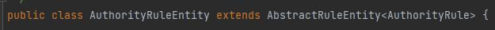

# Spring-Cloud-Starter-Alibaba-Sentinel-With-Nacos
 
#### 介绍
* 本项目来自开源社区提供的sentinel控制台整合nacos项目中发现的问题，这个问题会导致部分策略失效
* 问题简述：整合过nacos的sentinel-dashboard保存到nacos中的是被序列化为json的RuleEntity类型，而服务（sentinel-datasource-nacos）反序了化的目标类型是Rule类型，因此存在参数无法读取的情况
* 本项目参考开源项目如下：
    * github: [sentinel-dashboard1.8.6-nacos](https://github.com/wuyeing/sentinel-dashboard1.8.6-nacos)、[sentinel-dashboard1.8.6-nacos](https://github.com/max-holo/sentinel-dashboard1.8.6-nacos)、[sentinel-dashboard-nacos](https://github.com/modongning/sentinel-dashboard-nacos)
    * gitee: [sentinel-dashboard1.8.6-nacos](https://gitee.com/wuyeing/sentinel-dashboard1.8.6-nacos)


#### 使用方式

1. 导入坐标，可以代替原生的spring-cloud-starter-alibaba-sentinel
   ```pom
    <dependency>
        <groupId>yh.springcloud</groupId>
        <artifactId>Spring-Cloud-Starter-Alibaba-Sentinel-With-Nacos</artifactId>
        <version>0.0.1-SNAPSHOT</version>
    </dependency>
   ```

2. 配置，以yml为例；关于具体参数，可以见com.alibaba.cloud.sentinel.SentinelProperties#datasource

  ```yml
spring:
    cloud:
        nacos: 
            sentinel:
                datasource:
                    # 数据源的名称
                    flow:
                        # 数据源类型（支持nacos、zookeeper、redis等）
                        nacos:
                            # 指定nacos地址
                            server-addr: ${spring.cloud.nacos.server-addr}
                            # 指定远程配置文件的名称，配置文件是由控制台生成的，因此data-id、group-id、namespace需要遵循控制台的规则
                            data-id: ${spring.application.name}-flow-rules
                            group-id: SENTINEL_GROUP
                            namespace: 634f0e00-37b5-42ef-b028-cb1fe5bfc628
                            # 目前只支持json
                            data-type: json
                            # 规则类型（限流、降级、熔断等），详见com.alibaba.cloud.sentinel.datasource.RuleType
                            rule-type: flow
                    degrade:
                        nacos:
                            server-addr: ${spring.cloud.nacos.server-addr}
                            data-id: ${spring.application.name}-degrade-rules
                            group-id: SENTINEL_GROUP
                            namespace: 634f0e00-37b5-42ef-b028-cb1fe5bfc628
                            data-type: json
                            rule-type: degrade
                    param-flow:
                        nacos:
                            server-addr: ${spring.cloud.nacos.server-addr}
                            data-id: ${spring.application.name}-param-rules
                            group-id: SENTINEL_GROUP
                            namespace: 634f0e00-37b5-42ef-b028-cb1fe5bfc628
                            data-type: json
                            rule-type: param-flow
  ```

#### 问题详述

* 以[sentinel-dashboard1.8.6-nacos](https://gitee.com/wuyeing/sentinel-dashboard1.8.6-nacos)为例说明，
其com.alibaba.csp.sentinel.dashboard.datasource.entity.rule包下的ParamFlowRuleEntity、AuthorityRuleEntity都继承了AbstractRuleEntity



* AbstractRuleEntity将实际的Rule作为自己成员变量，这样序列化时会将真正的策略封装到更深的层级，如果直接把它当作Rule反序了化，则无法读取到参数，比如
  ```json
  [{"app":"sentinel-nacos-client",
    "gmtCreate":1695630637270,
    "gmtModified":1695631020567,
    "id":3,
    "ip":"127.0.0.1",
    "port":8720,
    // 封装到rule里面了
    "rule":
    {"burstCount":0,
      "clusterConfig":
      {"fallbackToLocalWhenFail":true,
        "sampleCount":10,
        "thresholdType":0,
        "windowIntervalMs":1000},
      "clusterMode":false,
      "controlBehavior":0,
      "count":0.0,
      "durationInSec":1,
      "grade":1,
      "limitApp":"default",
      "maxQueueingTimeMs":0,
      "paramFlowItemList":
      [
        {"classType":"java.lang.String","count":0,"object":"2"},
        {"classType":"java.lang.String","count":0,"object":"1"},
        {"classType":"java.lang.String","count":0,"object":"3"}],
      "paramIdx":0,"resource":"hot"}
  }]
  ```


* 而对于其他的RuleEntity，它们直接拥有与其对应Rule相同的成员变量，因此在反序列化时可以读取到参数，因此本项目并不需要对这种RuleEntity进行额外处理
比如FlowRuleEntity


#### 本项目的工作
* 本项目的代码较为简单，不再解读，简而言之就是修改反序列化时的逻辑，如果对应的是有问题的RuleEntity，不直接反序列化为Rule，而是先得到RuleEntity再获取Rule
* 具体可从本项目的自动配置类和Entity2RuleJsonConverter入手进行理解
